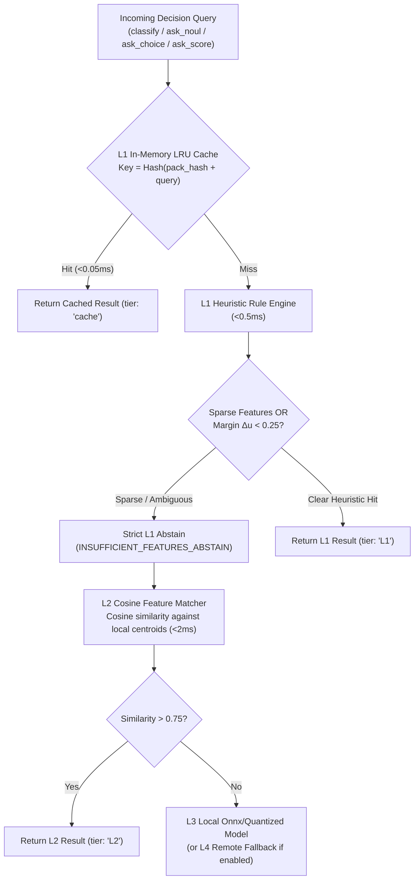

# 📐 PuterVision Cognitive Pentad & System 1 Architecture

> **A Dual-Process Cognitive Architecture for Autonomous Agents**: Decoupling slow, deliberative BDI reasoning (System 2) from sub-millisecond, deterministic, non-generative decision and execution loops (System 1).

---

## 1. The Core Problem & Dual-Process Architecture

Modern agent frameworks face a fundamental dilemma when deploying LLMs to interactive real-time environments (e.g. browser automation, game playing, terminal coding, continuous robotics):

```
+-------------------------------------------------------------------------+
|                  TRADITIONAL AGENT ARCHITECTURE (Slow Loop)              |
|                                                                         |
|  [Screenshot / DOM / State] -> [Giant Prompt (10k+ Tokens)]             |
|                                         |                               |
|                                         v (1.5s - 5.0s LLM latency)     |
|                                  [Frontier LLM]                         |
|                                         |                               |
|                                         v                               |
|                           [Generative Tool Call Text]                   |
|                                         |                               |
|                                         v (Stuttering, non-deterministic)|
|                                  [Action Execution]                     |
+-------------------------------------------------------------------------+
```

### Why System 1?

Inspired by cognitive dual-process theory and agent architectures—specifically the typed System 1 pattern pioneered by TypeSafe's **Jev** (evaluating typed `Choice`, `Score`, and `Noul` primitives over compact state without token generation)—PuterVision introduces a formalized **"System One" Fast Decision Layer**.

Where TypeSafe's Jev operates as a hosted neural decision model (~70–500ms), PuterVision implements that same architectural shape locally via in-memory LRU caches, deterministic heuristics, and vector centroid matching for sub-millisecond execution (<1ms) rather than calling the hosted Jev API:

1. **System 1 (Fast, Intuitive, Non-Generative)**:
   - Operates in **$<1\text{ms}$** using local in-memory LRU caches, heuristic decision trees, and vector centroid matching.
   - Evaluates typed, closed-vocabulary queries: categorical classification (`classify`), Boolean propositions (`ask_noul`), discrete alternatives (`ask_choice`), bounded scalar scoring (`ask_score`), and blast-radius security gating (`gate_intention`).
   - Generates zero conversational token burn and emits deterministic, calibrated probabilities.

2. **System 2 (Slow, Deliberative, BDI Cognition)**:
   - Operates on longer horizons ($\sim 1\text{s} - 5\text{s}$) for complex multi-step strategy.
   - Decomposes high-level objectives into dependency DAGs, updates beliefs with exponential decay, computes expected multi-attribute utilities (\(E[U] = \sum w_i u_i\)), and replans upon structural blockers.

```
                      +---------------------------------------+
                      |         SYSTEM 2 (Deliberative)       |
                      |   Formal BDI Reasoning & Planning     |
                      |   - Goal DAG Decomposition            |
                      |   - Multi-Objective Utility Weights   |
                      |   - Adaptive Replanning on Blockers   |
                      +---------------------------------------+
                                          |
                                   Long-Term Intent
                                          v
+------------------+       +------------------------------------+       +-------------------+
|  MEMORY SLICES   | ----> |     SYSTEM 1 (Fast Path)           | ----> |   ~60Hz RUNTIME   |
| - Compact Visual |       |   Sub-Millisecond Non-Generative   |       | Behavior Trees    |
| - Nearest Spatial|       |   - classify / ask_noul / choice   |       | - semantic_check  |
| - Compact Task   |       |   - HMAC Dispatch Token Gate       |       | - Reactive Trigger|
+------------------+       +------------------------------------+       +-------------------+
```

---

## 2. Multi-Modal Memory Slices & The Canonical `StatePack`

Rather than feeding raw megabyte payloads into decision engines, each Pentad memory server extracts an ultra-compact, high-density slice:

### A. Compact Memory Slices

1. **`vision-memory-mcp` $\to$ Visual Slice ($<1\text{KB}$)**:
   - Contains: `state_id`, layout perceptual SHA-256 hash, truncated text description summary ($\le 120$ chars), interactive AX element count, and vector embedding reference IDs.
   - Eliminates raw image base64 transmissions entirely.
2. **`world-model-mcp` $\to$ Spatial Slice ($<2\text{KB}$)**:
   - Contains: Observer coordinates $[x, y, z]$, relative heading, $K \le 16$ nearest entities sorted by Euclidean distance with relative bearings $[-180^\circ, 180^\circ]$, nearest obstacle distance, and deterministic `spatial_hash`.
3. **`state-memory-mcp` $\to$ Task Slice ($<1\text{KB}$)**:
   - Contains: Active goal ID and title, top active blocker summaries, and recent decision IDs.

### B. Canonical `StatePack` Contract (§10.1)

All three slices are merged into a canonical `StatePack` object with deterministic serialization:

```json
{
  "pack_id": "01M3DARSD1AH1HRVB8KKFY4NG0",
  "project": "live-exercise-arena",
  "session_id": "live_exercise_session_01",
  "timestamp": "2026-09-25T22:25:24.000Z",
  "spatial": {
    "observer_position": [0, 0, 0],
    "nearby_entities": [
      { "id": "player_hero", "type": "agent", "distance": 0.0, "status": "active" },
      { "id": "loot_chest", "type": "item", "distance": 4.0, "status": "active" },
      { "id": "guardian", "type": "npc", "distance": 7.1, "status": "active" }
    ]
  },
  "tasks": {
    "active_goal": { "id": "goal_01", "title": "Retrieve artifact", "priority": 0.9, "progress": 0.3 },
    "active_blockers": [{ "id": "blk_01", "description": "Guardian on patrol" }],
    "recent_decision_ids": []
  },
  "vitals": { "hp": 100.0, "threat_level": 0.25 },
  "utility": { "profile_name": "tactical_stealth" },
  "pack_hash": "0f78f9a9d58b9a95ba09d877ffc7bf405316bf5562bd90f99182739edce58b8a"
}
```

**Canonical Serialization Rules**:
- Keys sorted recursively in ascending alphanumeric order.
- Floating-point values rounded to 6 decimal places.
- No trailing whitespace or newlines.
- Byte-for-byte SHA-256 verification via `verifyPackHash(statePack)`.

---

## 3. Four-Tier Fast Decision Engine (L1 - L4)

The `DecisionEngine` evaluates queries using a tiered hierarchy with automatic escalation and fail-closed safety:



### Strict L1 Abstain Invariant
Unlike generative models that fabricate plausible hallucinations when uncertain, the L1 engine strictly **abstains** when feature density is insufficient or utility margin between candidate choices is smaller than the safety threshold ($\Delta u < 0.25$). Abstention triggers clean escalation to L2 centroid matching or flags the need for System 2 deliberation.

---

## 4. Cryptographic Intention Pre-Dispatch Security Gating

Before any intention directive is dispatched to the runtime behavior engine, it must pass through `gate_intention`:

1. **Blast-Radius Audit**: Checks destructive flags, target resources, and rate limits.
2. **HMAC-SHA256 Token Issuance**:
   - Computes HMAC signature over: `token_id:intention_id:behavior_name:params_hash:aud:issued_at:expires_at` using `PENTAD_HMAC_SECRET`.
   - Binds audience strictly to `"behavior-mcp"`.
   - Enforces a 30-second expiry window.
3. **Constant-Time Verification**:
   - `behavior-mcp` verifies the token using `crypto.timingSafeEqual`.
   - Prevents timing attacks, forged tokens, and cross-session replays.

---

## 5. ~60Hz Behavior Tree Execution & The `semantic_check` Invariant

Browser automation and gaming require deterministic $\sim 16.6\text{ms}$ tick loops. To prevent loop stalls:

- **No Async MCP Calls in Behavior Loops**: Behavior nodes never make network or asynchronous tool calls during a tick.
- **Synchronous `semantic_check` Condition**:
  - Checks pre-populated blackboard variables (`semantic_decision_<key>`).
  - Enforces a **5000ms freshness TTL**: if the cached decision is older than 5 seconds, the condition evaluates to `false` (fails closed).
- **Asynchronous Companion Action `request_semantic_evaluation`**:
  - Flags an off-tick request in the blackboard.
  - Returns status `RUNNING` until the background fast-path or System 2 updates the decision.

---

## 6. Thresholded State-Memory Trajectory Logging

High-frequency decision engines can generate tens of thousands of decisions per session. To prevent graph database bloat:

- **Significance Threshold ($\ge 0.70$)**: Only decisions with high strategic weight, unexpected state transitions, or holding signed dispatch tokens are written as full property graph nodes with `decided_in` edges.
- **Sub-Threshold Logging ($< 0.70$)**: High-confidence routine cache hits are recorded strictly in the append-only SQLite event ledger for auditability without graph clutter.
- **Interleaved Multimodal Trajectories**: `manage_data(action: "export_joint_trajectories")` correlates workflow steps, visual layout IDs, and `pack_hash` values for reproducible agent analysis and fine-tuning dataset export.

---

## 🔗 Related Documentation

- [**PuterVision Organization README**](https://github.com/putervision/.github/blob/main/profile/README.md)
- [**68-Tool Model Context Protocol Reference (`TOOLS.md`)**](https://github.com/putervision/.github/blob/main/profile/TOOLS.md)
- [**Getting Started & Client Configuration Guide (`GETTING_STARTED.md`)**](https://github.com/putervision/.github/blob/main/profile/GETTING_STARTED.md)
