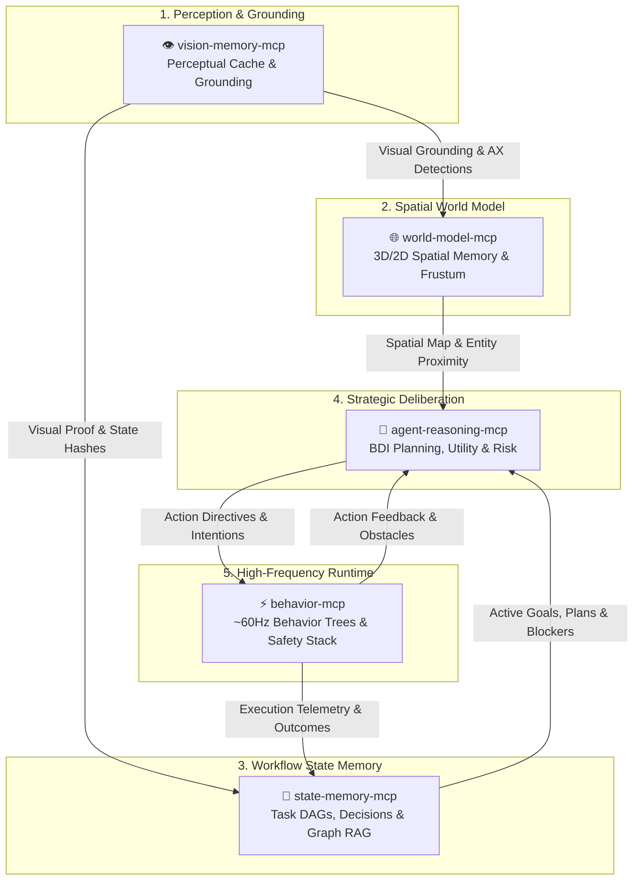

# PuterVision 👁️⚡

> **The Cognitive Pentad for Autonomous AI Agents** — Local-first Model Context Protocol (MCP) infrastructure providing persistent state memory, perceptual vision caching, 3D/2D spatial world models, strategic BDI reasoning, and high-frequency behavior execution.

[](https://github.com/putervision)
[](https://modelcontextprotocol.io/)
[](https://putervision.com)
[](https://putervision.com)

---

## 🌐 Overview

**PuterVision** engineers high-performance, zero-telemetry, local-first infrastructure and Model Context Protocol (MCP) servers for autonomous AI agents, coding assistants, and browser automation runtimes.

Modern frontier LLMs possess extraordinary semantic reasoning but suffer from three fundamental limitations: **stateless ephemeral contexts**, **visual token bloat**, and **lack of physical and behavioral grounding**.

The **PuterVision Cognitive Pentad** solves this by establishing a modular, local-first cognitive architecture where perception, memory, spatial world models, high-order deliberation, and reactive execution work in harmonious synergy—all powered by local SQLite, zero cloud dependencies, and sub-millisecond MCP dispatch.

---

## 🧠 The PuterVision Cognitive Pentad



### Key Open-Source Pentad MCP Servers

| Project | Badges | Focus & Capabilities | Links |
| :--- | :--- | :--- | :--- |
| **`state-memory-mcp`** | [](https://www.npmjs.com/package/@putervision/state-memory-mcp) | **Persistent Workflow State Memory**<br/>Zero-infrastructure, deterministic property graph backed by local SQLite. Eliminates AI amnesia by tracking tasks, decisions, artifacts, plans, and blockers with FTS5 RAG, DAG cycle detection, and an interactive WebGL 3D graph visualizer. | [GitHub](https://github.com/putervision/state-memory-mcp) • [npm](https://www.npmjs.com/package/@putervision/state-memory-mcp) • [Website](https://statememorymcp.com) |
| **`vision-memory-mcp`** | [](https://www.npmjs.com/package/@putervision/vision-memory-mcp) | **Visual Memory & Perceptual Grounding**<br/>Local-first perceptual cache using perceptual hashing (dHash/pHash), CLIP vector embeddings, AX tree element grounding, and UI transition graphs. Eliminates up to 90% of redundant LLM vision calls while ensuring deterministic target coordinates. | [GitHub](https://github.com/putervision/vision-memory-mcp) • [npm](https://www.npmjs.com/package/@putervision/vision-memory-mcp) • [Website](https://visionmemorymcp.com) |
| **`world-model-mcp`** | [](https://www.npmjs.com/package/@putervision/world-model-mcp) | **3D/2D Spatial World Model**<br/>Deterministic spatial internal world model for AI agents. Features entity tracking, object permanence across view occlusions, AABB collision prediction, navigation waypoints, and camera frustum field-of-view calculation. | [GitHub](https://github.com/putervision/world-model-mcp) • [npm](https://www.npmjs.com/package/@putervision/world-model-mcp) • [Website](https://worldmodelmcp.com) |
| **`agent-reasoning-mcp`** | [](https://www.npmjs.com/package/@putervision/agent-reasoning-mcp) | **Strategic BDI Cognitive Engine**<br/>Belief-Desire-Intention cognitive deliberation framework. Decomposes high-level objectives into dependency DAGs, calculates multi-objective utility scores, quantifies risk, maintains confidence-decayed beliefs, and executes adaptive replanning. | [GitHub](https://github.com/putervision/agent-reasoning-mcp) • [npm](https://www.npmjs.com/package/@putervision/agent-reasoning-mcp) • [Website](https://agentreasoningmcp.com) |
| **`behavior-mcp`** | [](https://www.npmjs.com/package/@putervision/behavior-mcp) | **~60Hz Behavior Tree Execution Engine**<br/>High-frequency in-browser behavior tree runtime for deterministic browser automation and game AI. Features priority reactive interrupts, a 5-layer fail-closed safety stack, telemetry capture, and deterministic action sequence replay. | [GitHub](https://github.com/putervision/behavior-mcp) • [npm](https://www.npmjs.com/package/@putervision/behavior-mcp) • [Website](https://behaviormcp.com) |

---

## 📦 Additional Projects & Supporting Libraries

Beyond the Core Pentad MCP servers, PuterVision develops specialized security, cryptographic, static analysis, and utility libraries:

| Project | Description | Links |
| :--- | :--- | :--- |
| **`spc`** *(Space Proof Code)* | High-performance, zero-dependency static analysis tool enforcing NASA Power of Ten safety-critical coding standards and security invariants across 20+ programming languages. | [GitHub](https://github.com/putervision/spc) • [npm](https://www.npmjs.com/package/@putervision/spc) |
| **`WebCrypt`** | Zero-dependency cryptographic vault suite for browser & Node.js Web Crypto API. Powers AES-256-GCM symmetric encryption, RSA-4096 hybrid public-key encryption, ECDH, digital signatures, and post-quantum security. | [GitHub](https://github.com/putervision/WebCrypt) • [npm](https://www.npmjs.com/package/webcrypt) • [Demo](https://putervision.github.io/WebCrypt/) |
| **`ScreenChunk`** | High-resolution screen capture, spatial chunking, and visual layout partitioning engine for dense browser and desktop interfaces. | [Website](https://screenchunk.com) |
| **`BassMusic.ai`** | Client-side, browser-native algorithmic and neural music generator demonstrating zero-server Web Audio processing. | [Website](https://bassmusic.ai) |

---

## 🛡️ Architectural Pillars

- 🔒 **100% Local-First & Zero Telemetry**: Your code, tasks, visual captures, spatial entities, and belief states reside strictly in local SQLite and memory caches. Zero cloud dependencies, zero external analytics, and zero data leakage.
- ⚡ **Sub-Millisecond Retrieval & Execution**: Eliminates massive context window token burn. High-frequency indexing, perceptual hashing, and local graph traversal deliver deterministic responses in `<2ms`.
- 🛡️ **Safety-Critical & Cryptographically Verifiable**: Engineered with fail-closed safety gates, watchdog circuit breakers, and SHA-256 Merkle audit chains for reproducible, tamper-proof agent trajectories.
- 🔌 **Universal MCP Compatibility**: Natively supported by **Claude Code**, **Cursor**, **Gemini CLI**, **Windsurf**, **VS Code**, and any Model Context Protocol compliant client.

---

## ⚡ Quickstart: Adding the Pentad to Your AI Assistant

Add the PuterVision Pentad servers to your favorite MCP-enabled editor or agent environment:

### Claude Code (`claude.json`) / Cursor (`.cursor/mcp.json`)

```json
{
  "mcpServers": {
    "state-memory-mcp": {
      "command": "npx",
      "args": ["-y", "@putervision/state-memory-mcp"]
    },
    "vision-memory-mcp": {
      "command": "npx",
      "args": ["-y", "@putervision/vision-memory-mcp"]
    },
    "world-model-mcp": {
      "command": "npx",
      "args": ["-y", "@putervision/world-model-mcp"]
    },
    "agent-reasoning-mcp": {
      "command": "npx",
      "args": ["-y", "@putervision/agent-reasoning-mcp"]
    },
    "behavior-mcp": {
      "command": "npx",
      "args": ["-y", "@putervision/behavior-mcp"]
    }
  }
}
```

---

## 🔗 Connect & Resources

- 🌐 **Official Website**: [putervision.com](https://putervision.com)
- 📦 **npm Organization**: [@putervision](https://www.npmjs.com/org/putervision)
- 🐙 **GitHub Organization**: [github.com/putervision](https://github.com/putervision)
- 📜 **License**: MIT Open Source & Commercial Enterprise Licenses Available
