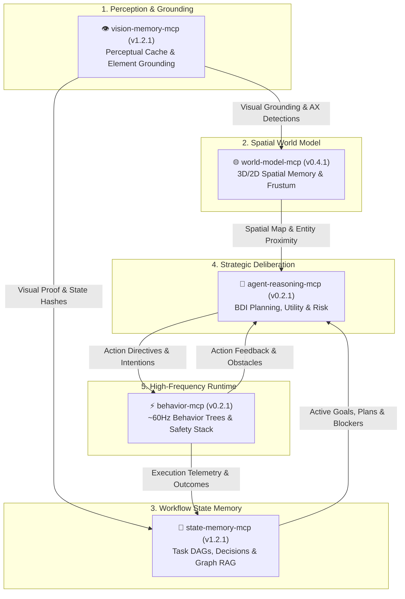

# PuterVision 👁️⚡

> **The Cognitive Pentad for Autonomous AI Agents** — Local-first Model Context Protocol (MCP) infrastructure providing persistent state memory, perceptual vision caching, 3D/2D spatial world models, strategic BDI reasoning, and high-frequency behavior execution.

[](https://github.com/putervision)
[](https://modelcontextprotocol.io/)
[](https://putervision.com)
[](https://putervision.com)
[-brightgreen.svg?style=flat-square)](https://github.com/putervision)
[](https://github.com/putervision)

---

## 🌐 Overview

**PuterVision** engineers high-performance, zero-telemetry, local-first infrastructure and Model Context Protocol (MCP) servers for autonomous AI agents, coding assistants, and browser automation runtimes.

Modern frontier LLMs possess extraordinary semantic reasoning but suffer from fundamental architectural bottlenecks:
- **Stateless Ephemeral Contexts**: "Agent amnesia" across tool steps, compaction cycles, and restarts.
- **Visual Token Bloat & Hallucinations**: Re-ingesting raw screen pixels costs thousands of tokens per step and degrades reasoning fidelity.
- **Absence of Spatial & Object Permanence**: Inability to track unobserved entities, physical bounds, or 3D view projections.
- **Uncalibrated Deliberation**: Ad-hoc tool execution without formal multi-objective utility scoring or risk quantification.
- **Sluggish, Non-Deterministic Action Loops**: High-latency LLM roundtrips incapable of handling reactive events or ~60Hz browser/game controls.

The **PuterVision Cognitive Pentad** solves these limitations through a modular, synergistic local-first architecture. Backed by local SQLite databases in WAL mode, sub-millisecond dispatch, SHA-256 Merkle audit trails, and zero external network calls, each server handles a distinct cognitive tier while seamlessly interoperating across shared data structures.

---

## 🧠 The PuterVision Cognitive Pentad



### Core Pentad MCP Servers

| Project | Version | Badges | Focus & Capabilities | Links |
| :--- | :---: | :--- | :--- | :--- |
| **`state-memory-mcp`** | `1.2.1` | [](https://www.npmjs.com/package/@putervision/state-memory-mcp) [](https://github.com/putervision/state-memory-mcp/actions/workflows/ci.yml) | **Persistent Workflow State Memory (15 Tools)**<br/>Zero-infrastructure, deterministic property graph backed by local SQLite in WAL mode. Tracks tasks, architectural decisions, artifacts, plans, and blockers. Features FTS5 full-text search, DAG cycle detection, multi-turn session attribution, SHA-256 Merkle audit chains, and WebGL 3D graph visualization. | [GitHub](https://github.com/putervision/state-memory-mcp) • [npm](https://www.npmjs.com/package/@putervision/state-memory-mcp) • [Website](https://statememorymcp.com) |
| **`vision-memory-mcp`** | `1.2.1` | [](https://www.npmjs.com/package/@putervision/vision-memory-mcp) [](https://github.com/putervision/vision-memory-mcp/actions/workflows/ci.yml) | **Visual Memory & Perceptual Grounding (15 Tools)**<br/>Local-first perceptual cache using perceptual hashing (dHash/pHash), local CLIP vector embeddings via LanceDB, and Accessibility (AX) tree element grounding. Eliminates up to 90% of redundant vision LLM calls while predicting precise click/type coordinates and verifying Visual SDD specs. | [GitHub](https://github.com/putervision/vision-memory-mcp) • [npm](https://www.npmjs.com/package/@putervision/vision-memory-mcp) • [Website](https://visionmemorymcp.com) |
| **`world-model-mcp`** | `0.4.1` | [](https://www.npmjs.com/package/@putervision/world-model-mcp) [](https://github.com/putervision/world-model-mcp/actions/workflows/ci.yml) | **3D/2D Spatial World Model (15 Tools)**<br/>Deterministic spatial internal world model for AI agents. Delivers persistent entity tracking, object permanence across occlusions with confidence decay, spatial topological relations (`on`, `inside`, `near`), AABB collision prediction, expected view frustum projection, Three.js bridge, and Playwright 3D automation. | [GitHub](https://github.com/putervision/world-model-mcp) • [npm](https://www.npmjs.com/package/@putervision/world-model-mcp) • [Website](https://worldmodelmcp.com) |
| **`agent-reasoning-mcp`** | `0.2.1` | [](https://www.npmjs.com/package/@putervision/agent-reasoning-mcp) [](https://github.com/putervision/agent-reasoning-mcp/actions/workflows/ci.yml) | **Strategic BDI Cognitive Engine (10 Tools)**<br/>Formal Belief-Desire-Intention cognitive deliberation framework. Decomposes complex objectives into dependency DAGs, computes multi-objective expected utility scores (\(E[U] = \sum w_i u_i\)), assesses quantitative risk, decays belief confidences, and triggers adaptive replanning upon obstacles. | [GitHub](https://github.com/putervision/agent-reasoning-mcp) • [npm](https://www.npmjs.com/package/@putervision/agent-reasoning-mcp) • [Website](https://agentreasoningmcp.com) |
| **`behavior-mcp`** | `0.2.1` | [](https://www.npmjs.com/package/@putervision/behavior-mcp) [](https://github.com/putervision/behavior-mcp/actions/workflows/ci.yml) | **~60Hz Behavior Tree Execution Engine (10 Tools)**<br/>High-frequency in-browser behavior tree tactical runtime. Delivers deterministic execution with priority reactive triggers, cooldown guards, a 5-layer fail-closed safety stack, telemetry capture, deterministic action sequence replay, stuck recovery, and SHA-256 Merkle audit verification. | [GitHub](https://github.com/putervision/behavior-mcp) • [npm](https://www.npmjs.com/package/@putervision/behavior-mcp) • [Website](https://behaviormcp.com) |

---

## 🛠️ Pentad 65-Tool Registry Summary

The 5 servers expose a unified surface of **65 specialized Model Context Protocol tools**:

```
├── state-memory-mcp (15 tools)
│   ├── manage_nodes          - Create, update, query, and batch-process workflow entities
│   ├── manage_edges          - Build and query typed DAG dependency and semantic links
│   ├── manage_sessions       - Multi-turn workflow tracking and agent change attribution
│   ├── manage_tasks          - Priority queue, runnable task extraction, and blocker resolution
│   ├── manage_snapshots      - Checkpoint and time-travel rollback with diff inspection
│   ├── manage_specs          - SDD design contract baseline verification and compliance
│   ├── manage_database       - SQLite maintenance, diagnostics, and SHA-256 Merkle audits
│   ├── manage_data           - Interleaved multi-modal trajectory and dataset export
│   ├── query_graph           - Depth-bounded DAG traversal, shortest paths, and cycles
│   ├── get_analytics         - Summary statistics, velocity, and blocker analytics
│   ├── get_events            - Event-sourced changelog and session-level mutation feeds
│   ├── run_diagnostics       - Graph health validation, orphan detection, and cycle checks
│   ├── use_blackboard        - Shared key-value state blackboard for multi-agent workflows
│   ├── link_visual_proof     - Connect workflow tasks to perceptual vision state IDs
│   └── register_milestone    - Project milestone tracking and release boundary anchors
│
├── vision-memory-mcp (15 tools)
│   ├── analyze_screenshot    - Perceptual hash lookup, vector search, and AX tree grounding
│   ├── recall_memory         - Semantic text & image similarity search over visual states
│   ├── record_outcome        - Record UI action transitions and log visual blocker states
│   ├── get_navigation_paths  - BFS shortest-path graph traversal between visual states
│   ├── predict_next_action   - Predict optimal UI action and target screen coordinates
│   ├── compare_states        - Structural perceptual diffing and video keyframe comparison
│   ├── get_session_context   - Aggregated visual metrics, cache hit ratios, and state timeline
│   ├── manage_snapshot       - Save, restore, and diff visual memory checkpoints
│   ├── manage_visual_spec    - Visual SDD contract baseline registration and live verification
│   ├── manage_video          - Ingest and search video recordings with keyframe extraction
│   ├── create_evidence_pack  - Cryptographic multimodal evidence packages with SHA-256 hashes
│   ├── export_trajectories   - Export training datasets in JSON, LLaVA, and Qwen2-VL formats
│   ├── undo_visual_mutation  - Revert accidental state or transition edge ingestions
│   ├── forget_state          - Purge sensitive or secret visual states for privacy compliance
│   └── wait_for_visual_state - Polling barrier waiting until target UI state renders
│
├── world-model-mcp (15 tools)
│   ├── update_entity         - Create/update 3D/2D entities with positions, bounds, and properties
│   ├── query_entities        - FTS5 keyword, spatial proximity radius, and tag filtering
│   ├── set_relation          - Record spatial relations (on, inside, next_to, above, contains)
│   ├── get_spatial_map       - Export JSON, GeoJSON, topological graph, glTF, OBJ, or summary
│   ├── simulate_movement     - Predict trajectories, test AABB obstacle collisions, plan waypoints
│   ├── ingest_observation    - Merge vision detections into world model with re-identification
│   ├── get_expected_view     - Compute entities visible within observer pose and FOV cone
│   ├── link_to_goal          - Associate spatial entities with state-memory workflow task IDs
│   ├── record_outcome        - Persist action outcomes and entity mutations in spatial log
│   ├── manage_spatial_spec   - Spatial SDD physical constraint baseline registration and checks
│   ├── create_evidence_pack  - Generate cryptographic SHA-256 spatial evidence bundles
│   ├── use_spatial_blackboard- Shared spatial intent board with spatial mutex locks
│   ├── manage_snapshot       - Spatial time-travel snapshots, diffs, and state restore
│   ├── generate_game_inputs  - Generate Playwright automation inputs and screen-to-3D unprojection
│   └── wait_for_spatial_state- Block until an entity reaches specified spatial conditions
│
├── agent-reasoning-mcp (10 tools)
│   ├── set_goal              - Manage hierarchical goal DAGs and decompose complex intents
│   ├── evaluate_situation    - Score and rank candidate actions via multi-attribute utility
│   ├── replan                - Dynamically reconstruct subgoals upon obstacles or failures
│   ├── assess_risk           - Quantitative threat scoring and risk-adjusted probability calculation
│   ├── query_knowledge       - Search heuristics, historical decisions, and strategic patterns
│   ├── set_utility_weights   - Tune agent priorities (aggression, caution, greed, exploration)
│   ├── get_decision_trace    - Chain-of-thought rationale playback and audit verification
│   ├── manage_beliefs        - Structured belief state tracking with exponential confidence decay
│   ├── manage_intentions     - Dispatch actionable directives queue to runtime behavior engine
│   └── manage_reasoning_db   - Diagnostics, snapshots, diffs, and SHA-256 Merkle audits
│
└── behavior-mcp (10 tools)
    ├── load_behavior         - Inject, initialize, or hot-swap behavior tree execution loops
    ├── set_parameters        - Dynamically update runtime behavior tree execution variables
    ├── get_status            - Query active traversal node path, tick count, duration, and errors
    ├── abort_behavior        - Immediately halt, pause, resume execution, or disengage inputs
    ├── register_trigger      - Configure priority reactive interrupts with cooldown guards
    ├── replay_recording      - Deterministic frame sequence capture and adaptive timing replay
    ├── get_metrics           - Execution telemetry, tick duration histograms, and stuck events
    ├── manage_behaviors      - Register and version behavior tree definitions with SHA-256 verification
    ├── manage_blackboard     - Read, write, delete, lease, and list shared behavior variables
    └── manage_runtime_db     - Database maintenance, diagnostics, and SHA-256 Merkle audits
```

---

## 📦 Additional Projects & Supporting Libraries

Beyond the Core Pentad MCP servers, PuterVision develops and maintains production-grade security, cryptographic, static analysis, and utility libraries:

| Project | Description | Links |
| :--- | :--- | :--- |
| **`spc`** *(Space Proof Code)* | High-performance, zero-dependency static analysis tool enforcing NASA Power of Ten safety-critical coding standards and security invariants across 20+ programming languages. | [GitHub](https://github.com/putervision/spc) • [npm](https://www.npmjs.com/package/@putervision/spc) |
| **`WebCrypt`** | Zero-dependency cryptographic vault suite for browser & Node.js Web Crypto API. Powers AES-256-GCM symmetric encryption, RSA-4096 hybrid public-key encryption, ECDH, digital signatures, and post-quantum security. | [GitHub](https://github.com/putervision/WebCrypt) • [npm](https://www.npmjs.com/package/webcrypt) • [Demo](https://putervision.github.io/WebCrypt/) |
| **`ScreenChunk`** | High-resolution screen capture, spatial chunking, and visual layout partitioning engine for dense browser and desktop interfaces. | [Website](https://screenchunk.com) |
| **`BassMusic.ai`** | Client-side, browser-native algorithmic and neural music generator demonstrating zero-server Web Audio processing. | [Website](https://bassmusic.ai) |

---

## 🛡️ Architectural Pillars

- 🔒 **100% Local-First & Zero Telemetry**: All tasks, decisions, visual caches, 3D entity models, and reasoning beliefs reside strictly in local SQLite and LanceDB files on your machine. Zero cloud dependencies, zero external analytics collection, and zero data leakage.
- ⚡ **Sub-Millisecond Retrieval & Execution**: Eliminates massive context window token burn. High-frequency indexing, perceptual hashing, and local graph traversal deliver deterministic responses in `<2ms`.
- 🛡️ **Fail-Closed Safety & Tamper-Proof Audit**: Engineered with 5-layer safety stacks, watchdog circuit breakers, and SHA-256 Merkle audit chains for reproducible, tamper-evident agent trajectories.
- 🧪 **Exhaustive Automated Verification**: Backed by **1,253 automated unit, integration, and stress tests** across 268 test suites with zero version drift verified across all configurations, manifests, docs, and releases.
- 🔌 **Universal MCP Compatibility**: Natively supported by **Claude Code**, **Cursor**, **Gemini CLI / Antigravity**, **Windsurf**, **VS Code**, and any Model Context Protocol compliant client.

---

## ⚡ Quickstart: Adding the Pentad to Your AI Assistant

Add the PuterVision Pentad servers to your favorite MCP-enabled editor or agent environment:

### Claude Code (`claude.json`) / Cursor (`.cursor/mcp.json`) / Windsurf (`mcp_config.json`)

```json
{
  "mcpServers": {
    "state-memory-mcp": {
      "command": "npx",
      "args": ["-y", "@putervision/state-memory-mcp"]
    },
    "vision-memory-mcp": {
      "command": "npx",
      "args": ["-y", "@putervision/vision-memory-mcp"]
    },
    "world-model-mcp": {
      "command": "npx",
      "args": ["-y", "@putervision/world-model-mcp"]
    },
    "agent-reasoning-mcp": {
      "command": "npx",
      "args": ["-y", "@putervision/agent-reasoning-mcp"]
    },
    "behavior-mcp": {
      "command": "npx",
      "args": ["-y", "@putervision/behavior-mcp"]
    }
  }
}
```

### Alternative: Global CLI Installation

```bash
# Install all 5 Pentad servers globally
npm install -g \
  @putervision/state-memory-mcp \
  @putervision/vision-memory-mcp \
  @putervision/world-model-mcp \
  @putervision/agent-reasoning-mcp \
  @putervision/behavior-mcp

# Initialize project databases in your working directory
state-memory-mcp init
vision-memory-mcp init
world-model-mcp init
agent-reasoning-mcp init
behavior-mcp init
```

---

## 🔗 Connect & Resources

- 🌐 **Official Website**: [putervision.com](https://putervision.com)
- 📦 **npm Organization**: [@putervision](https://www.npmjs.com/org/putervision)
- 🐙 **GitHub Organization**: [github.com/putervision](https://github.com/putervision)
- 📜 **License**: MIT Open Source

