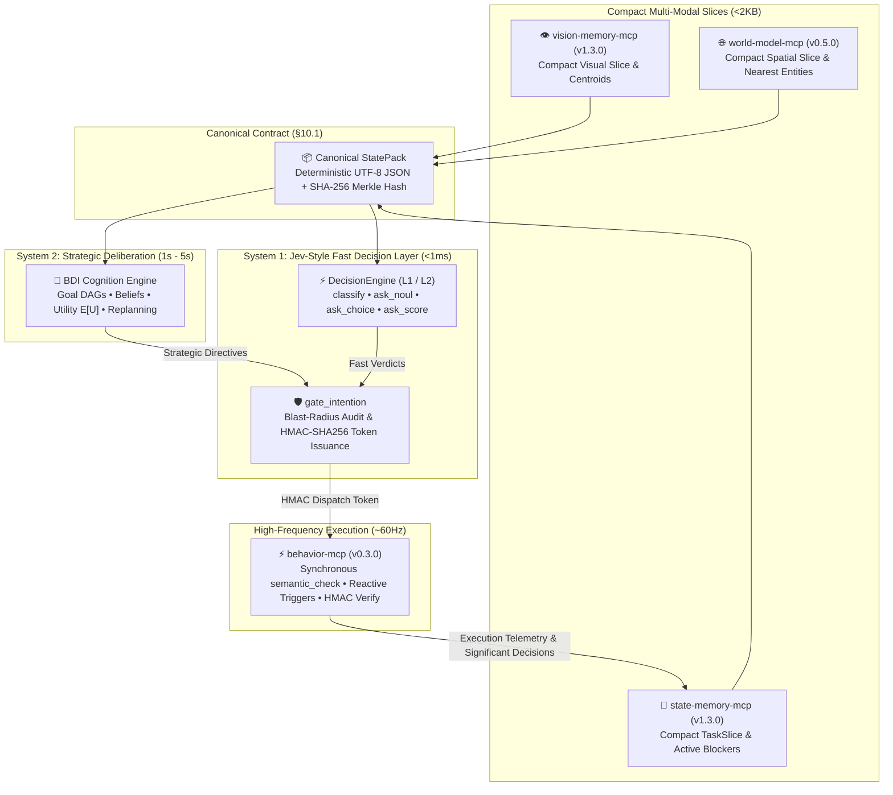

# PuterVision 👁️⚡

> **The Cognitive Pentad for Autonomous AI Agents** — Local-first Model Context Protocol (MCP) infrastructure providing persistent state memory, perceptual vision caching, 3D/2D spatial world models, strategic BDI reasoning, and Jev-style "System One" fast decision execution.

[](https://github.com/putervision)
[](https://modelcontextprotocol.io/)
[](https://github.com/putervision/.github/blob/main/profile/ARCHITECTURE.md)
[](https://putervision.com)
[-brightgreen.svg?style=flat-square)](https://github.com/putervision)
[](https://github.com/putervision)

---

## 🌐 Overview

**PuterVision** engineers high-performance, zero-telemetry, local-first infrastructure and Model Context Protocol (MCP) servers for autonomous AI agents, coding assistants, and high-frequency browser/game automation runtimes.

Modern frontier LLMs possess remarkable semantic reasoning but suffer from fundamental architectural bottlenecks when interacting with continuous, real-time environments:
- **Stateless Ephemeral Contexts**: "Agent amnesia" across tool steps, compaction cycles, and session restarts.
- **Visual Token Bloat & Hallucination**: Re-ingesting raw screen pixels burns thousands of tokens per step, induces latency, and degrades reasoning fidelity.
- **Absence of Spatial & Object Permanence**: Inability to track unobserved entities, physical collision bounds, or 3D view projections.
- **Uncalibrated Deliberation**: Ad-hoc tool execution without formal multi-objective utility scoring or quantitative risk calculation.
- **Sluggish, Non-Deterministic Action Loops**: Multi-second LLM roundtrips incapable of handling reactive events or ~60Hz browser/game controls.

The **PuterVision Cognitive Pentad** resolves these bottlenecks through a modular, synergistic architecture. Backed by local SQLite databases in WAL mode, sub-millisecond retrieval, SHA-256 Merkle audit trails, and zero external network calls, each server handles a distinct cognitive tier while seamlessly interoperating across shared data structures.

---

## ⚡ The Dual-Process Loop: Jev-Style "System One" Fast Path

Inspired by dual-process cognitive science and high-frequency agent architectures pioneered by community innovators such as **Jev** (who demonstrated the power of decoupling fast, non-generative classification and action gating from slow frontier LLM calls), PuterVision introduces a formalized **Jev-Style "System One" Fast Decision Layer**:

1. **System 1 (Fast, Intuitive, Non-Generative)**:
   - Operates in **$<1\text{ms}$** using local in-memory LRU caches, heuristic decision trees, and vector centroid matching.
   - Evaluates typed, non-generative primitives: categorical labeling (`classify`), Boolean propositions (`ask_noul`), discrete alternatives (`ask_choice`), scalar scoring (`ask_score`), and blast-radius security gating (`gate_intention`).
   - Strictly **abstains** when features are sparse or margins are ambiguous ($\Delta u < 0.25$), triggering clean escalation without hallucinations.
2. **System 2 (Slow, Deliberative, BDI Cognition)**:
   - Operates on longer horizons ($\sim 1\text{s} - 5\text{s}$) for multi-step strategic planning.
   - Decomposes high-level objectives into dependency DAGs, updates beliefs with exponential decay, computes expected multi-attribute utilities (\(E[U] = \sum w_i u_i\)), and replans upon structural blockers.


```mermaid
flowchart TD
    subgraph Slices ["Compact Multi-Modal Slices (<2KB)"]
        VM["👁️ vision-memory-mcp (v1.3.0)<br/>Compact Visual Slice & Centroids"]
        WM["🌐 world-model-mcp (v0.5.0)<br/>Compact Spatial Slice & Nearest Entities"]
        SM["💾 state-memory-mcp (v1.3.0)<br/>Compact TaskSlice & Active Blockers"]
    end

    subgraph StatePackAssembly ["Canonical Contract (§10.1)"]
        SP["📦 Canonical StatePack<br/>Deterministic UTF-8 JSON + SHA-256 Merkle Hash"]
    end

    subgraph System2 ["System 2: Strategic Deliberation (1s - 5s)"]
        BDI["🧭 BDI Cognition Engine<br/>Goal DAGs • Beliefs • Utility E[U] • Replanning"]
    end

    subgraph System1 ["System 1: Jev-Style Fast Decision Layer (<1ms)"]
        DE["⚡ DecisionEngine (L1 / L2)<br/>classify • ask_noul • ask_choice • ask_score"]
        IG["🛡️ gate_intention<br/>Blast-Radius Audit & HMAC-SHA256 Token Issuance"]
    end

    subgraph Runtime ["High-Frequency Execution (~60Hz)"]
        BM["⚡ behavior-mcp (v0.3.0)<br/>Synchronous semantic_check • Reactive Triggers • HMAC Verify"]
    end

    VM --> SP
    WM --> SP
    SM --> SP
    SP --> BDI
    SP --> DE
    BDI -->|Strategic Directives| IG
    DE -->|Fast Verdicts| IG
    IG -->|HMAC Dispatch Token| BM
    BM -->|Execution Telemetry & Significant Decisions| SM
```

---

## 🧠 Core Pentad MCP Servers

The Pentad exposes a unified surface of **68 specialized Model Context Protocol tools** across 5 local-first servers:

| Project | Version | Badges | Focus & Capabilities | Deep-Dive Links |
| :--- | :---: | :--- | :--- | :--- |
| **`state-memory-mcp`** | `1.3.0` | [](https://www.npmjs.com/package/@putervision/state-memory-mcp) | **Persistent Workflow State Memory (13 Tools)**<br/>Zero-infrastructure, deterministic property graph backed by local SQLite in WAL mode. Tracks tasks, architectural decisions, artifacts, plans, and blockers. Features FTS5 search, DAG cycle detection, multi-turn session attribution, SHA-256 Merkle audit chains, WebGL 3D graph visualization, compact `TaskSlice` queries, and thresholded fast decision logging. | [GitHub](https://github.com/putervision/state-memory-mcp) • [Website](https://statememorymcp.com) |
| **`vision-memory-mcp`** | `1.3.0` | [](https://www.npmjs.com/package/@putervision/vision-memory-mcp) | **Visual Memory & Perceptual Grounding (15 Tools)**<br/>Local-first perceptual cache using perceptual hashing (dHash/pHash), local CLIP vector embeddings via LanceDB, and Accessibility (AX) tree element grounding. Eliminates up to 90% of redundant vision LLM calls while predicting precise click/type coordinates, verifying Visual SDD specs, and exporting sub-1KB `compact_slice` representations. | [GitHub](https://github.com/putervision/vision-memory-mcp) • [Website](https://visionmemorymcp.com) |
| **`world-model-mcp`** | `0.5.0` | [](https://www.npmjs.com/package/@putervision/world-model-mcp) | **3D/2D Spatial World Model (15 Tools)**<br/>Deterministic spatial internal world model for AI agents. Delivers persistent entity tracking, object permanence across occlusions with confidence decay, spatial topological relations (`on`, `inside`, `near`), AABB collision prediction, expected view frustum projection, Three.js bridge, Playwright 3D automation, and observer-relative `compact_slice` ($K \le 16$ nearest entities). | [GitHub](https://github.com/putervision/world-model-mcp) • [Website](https://worldmodelmcp.com) |
| **`agent-reasoning-mcp`** | `0.3.0` | [](https://www.npmjs.com/package/@putervision/agent-reasoning-mcp) | **Strategic BDI Engine & System 1 Fast Decision Layer (15 Tools)**<br/>Formal Belief-Desire-Intention cognitive deliberation framework + Jev-style typed non-generative System 1 fast path (`classify`, `ask_noul`, `ask_choice`, `ask_score`, `gate_intention`). Decomposes complex objectives into dependency DAGs, computes multi-objective expected utility scores (\(E[U] = \sum w_i u_i\)), assesses quantitative risk, decays belief confidences, signs HMAC intention dispatch tokens, and triggers adaptive replanning. | [GitHub](https://github.com/putervision/agent-reasoning-mcp) • [Website](https://agentreasoningmcp.com) |
| **`behavior-mcp`** | `0.3.0` | [](https://www.npmjs.com/package/@putervision/behavior-mcp) | **~60Hz Behavior Tree Execution Engine (10 Tools)**<br/>High-frequency in-browser behavior tree tactical runtime. Delivers deterministic execution with priority reactive triggers, cooldown guards, synchronous `semantic_check` blackboard condition nodes, HMAC intention dispatch token verification, a 5-layer fail-closed safety stack, telemetry capture, deterministic action sequence replay, stuck recovery, and SHA-256 Merkle audits. | [GitHub](https://github.com/putervision/behavior-mcp) • [Website](https://behaviormcp.com) |

---

## 📦 Ecosystem & Supporting Projects

Beyond the 5 Core Pentad MCP servers, PuterVision develops and maintains specialized security scanning, cryptographic, visual studio, and web tools:

| Project | Version | Focus & Purpose | Links |
| :--- | :---: | :--- | :--- |
| **`@putervision/spc`** | `1.5.0` | **System Prompt Compiler & Security Scanner (Space Proof Code)**<br/>AST pattern analyzer enforcing NASA Power of Ten invariants, structural taint tracking, and prompt injection defense. | [GitHub](https://github.com/putervision/spc) • [npm](https://www.npmjs.com/package/@putervision/spc) |
| **`WebCrypt`** | `0.2.0` | **Zero-Dependency Cryptographic Vault Suite**<br/>AES-256-GCM symmetric encryption, RSA-4096 hybrid public-key encryption, digital signatures, and post-quantum cryptography (ML-KEM / ML-DSA). | [GitHub](https://github.com/LucasArmstrong/WebCrypt) • [npm](https://www.npmjs.com/package/webcrypt) • [Demo](https://putervision.github.io/WebCrypt/) |
| **`ScreenChunk`** | `0.1.0` | **High-Resolution Visual Partitioning & Spatial Tiling**<br/>Partitioning dense desktop and browser viewports into visual chunks for spatial grounding. | [GitHub](https://github.com/LucasArmstrong/screenchunk) • [Website](https://screenchunk.com) |
| **`putervision-ui`** | `0.1.0` | **Interactive Visual Memory & Spatial Graph Studio**<br/>Front-end Angular & WebGL workbench for inspecting live perceptual caches, 3D world model entities, and workflow DAGs. | [GitHub](https://github.com/putervision/putervision-ui) |
| **`BassMusic.ai`** | - | **Algorithmic & Neural Web Audio Music Generator**<br/>Client-side, browser-native algorithmic and neural music generator demonstrating zero-server Web Audio processing. | [Website](https://bassmusic.ai) |

---

## 📚 Modular Documentation

To keep this overview concise and readable, deep architectural and reference specifications have been organized into specialized sub-documents:

| Document | Topic & Focus | Key Highlights |
| :--- | :--- | :--- |
| [**🛠️ 68-Tool Reference (`TOOLS.md`)**](https://github.com/putervision/.github/blob/main/profile/TOOLS.md) | **Complete MCP Tool Reference** | Exhaustive catalog of all 68 Model Context Protocol tools, action modes, input parameters, and cross-server synergy links. |
| [**📐 Architecture Deep Dive (`ARCHITECTURE.md`)**](https://github.com/putervision/.github/blob/main/profile/ARCHITECTURE.md) | **System 1 & Jev-Style Fast Path** | Detailed breakdown of the Dual-Process architecture, StatePack Merkle specification (§10.1), L1-L4 decision tiers, HMAC intention tokens, and ~60Hz `semantic_check` invariants. |
| [**🚀 Getting Started & Setup (`GETTING_STARTED.md`)**](https://github.com/putervision/.github/blob/main/profile/GETTING_STARTED.md) | **Installation & Client Configuration** | Step-by-step setup guides and ready-to-use JSON configuration templates for Claude Code, Cursor, Windsurf, VS Code, and Google Antigravity. |

---

## 🛡️ Core Architectural Pillars

- 🔒 **100% Local-First & Zero Telemetry**: All tasks, decisions, visual caches, 3D entity models, and reasoning beliefs reside strictly in local SQLite and LanceDB files on your machine. Zero cloud dependencies, zero external analytics collection, and zero data leakage.
- ⚡ **Sub-Millisecond Retrieval & Execution**: Eliminates massive context window token burn. High-frequency indexing, perceptual hashing, and local graph traversal deliver deterministic responses in `<1ms`.
- 🛡️ **Fail-Closed Safety & Cryptographic Gating**: Engineered with 5-layer safety stacks, watchdog circuit breakers, constant-time HMAC-SHA256 intention dispatch token verification, and SHA-256 Merkle audit chains for reproducible, tamper-evident agent trajectories.
- 🧪 **Exhaustive Automated Verification**: Backed by **1,406 automated unit, integration, and live synergy tests** (100% pass rate across 294 test files) with zero version drift verified across all packages, manifests, and documentation.
- 🔌 **Universal MCP Compatibility**: Natively supported by **Claude Code**, **Cursor**, **Gemini CLI / Antigravity**, **Windsurf**, **VS Code**, and any Model Context Protocol compliant client.

---

## ⚡ Quickstart

### 1. Instant Setup (No Installation Required)

Add the Pentad servers directly to your AI assistant configuration (`claude.json`, `.cursor/mcp.json`, `mcp_config.json`):

```json
{
  "mcpServers": {
    "state-memory-mcp": {
      "command": "npx",
      "args": ["-y", "@putervision/state-memory-mcp"]
    },
    "vision-memory-mcp": {
      "command": "npx",
      "args": ["-y", "@putervision/vision-memory-mcp"]
    },
    "world-model-mcp": {
      "command": "npx",
      "args": ["-y", "@putervision/world-model-mcp"]
    },
    "agent-reasoning-mcp": {
      "command": "npx",
      "args": ["-y", "@putervision/agent-reasoning-mcp"],
      "env": {
        "PENTAD_HMAC_SECRET": "your-secure-32-byte-secret-key-here"
      }
    },
    "behavior-mcp": {
      "command": "npx",
      "args": ["-y", "@putervision/behavior-mcp"],
      "env": {
        "PENTAD_HMAC_SECRET": "your-secure-32-byte-secret-key-here"
      }
    }
  }
}
```

### 2. Local CLI Installation & Workspace Initialization

Install the servers globally for direct CLI commands and local background daemons:

```bash
npm install -g \
  @putervision/state-memory-mcp \
  @putervision/vision-memory-mcp \
  @putervision/world-model-mcp \
  @putervision/agent-reasoning-mcp \
  @putervision/behavior-mcp
```

Initialize your workspace databases and scaffold IDE agent instruction rules:

```bash
state-memory-mcp init && vision-memory-mcp init && world-model-mcp init && agent-reasoning-mcp init && behavior-mcp init
```

> For full client configuration templates (Cursor, Claude Code, Windsurf, Antigravity, VS Code), environment variables, and Docker setups, see the [**Getting Started Guide (`GETTING_STARTED.md`)**](https://github.com/putervision/.github/blob/main/profile/GETTING_STARTED.md).

---

## 🔗 Connect & Resources

- 🌐 **Official Website**: [putervision.com](https://putervision.com)
- 📦 **npm Organization**: [@putervision](https://www.npmjs.com/org/putervision)
- 🐙 **GitHub Organization**: [github.com/putervision](https://github.com/putervision)
- 📜 **License**: MIT Open Source
